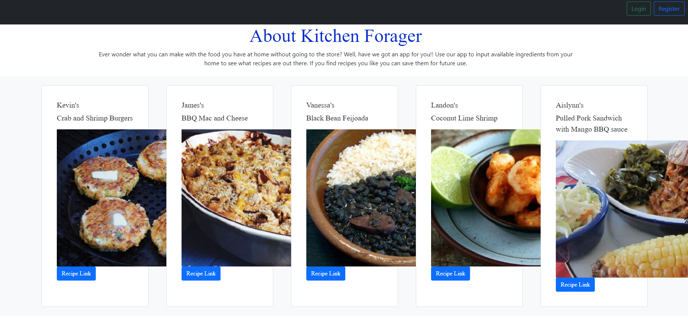
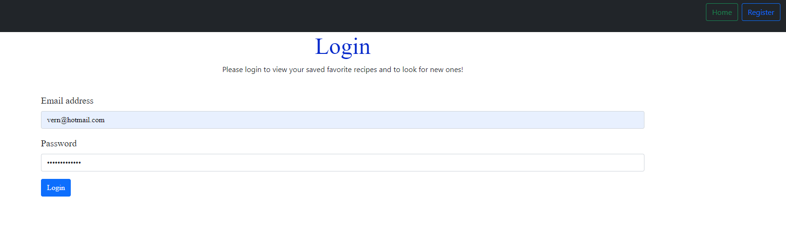
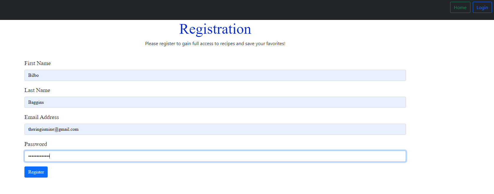
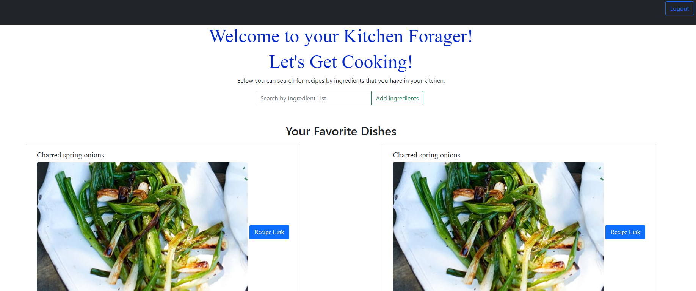

# kitchenForager

  
#### Table of Contents
* [Project Description](#project-description)
* [Contributors](#contributors)
* [Installation Instructions](#installation-instructions)
* [Usage Information](#usage-information)
* [Contributor Guidelines](#contributor-guidelines)
* [Code of Conduct](#code-of-conduct)
* [License](#license)
* [Test Instructions](#test-instructions)
* [Questions](#questions)
* [Deployment Image](#deployment-image)

## Project Description
* Ever wonder what you can make with the food you have at home without going to the store? Well, have we got an app for you!! With the Kitchen Forager app you can input available ingredients from your home to see what recipes are out there. If you find recipes you like you can save them for future use. We want to help you save money and cook from home!

## Contributors
* Kevin Devlin
* Landon Waddell
* Aislynn Uribe
* Vanessa Bonilha
* James Odell

## Installation Instructions
* Express
* MySQL
* Sequelize
* Axios
* bcrypt
* connect-session-sequelize
* express-handlebars
* express-session
* validator

## Usage Information
* You need to install the packages above to be able to run this code.

## Contributor Guidelines
* Contribution rules are under the Code of Conduct section

## Code of Conduct
* [Contributor Code of Conduct](https://www.contributor-covenant.org/version/2/0/code_of_conduct/code_of_conduct.md)

## Test Instructions
* No test required

## License
* MIT License

## Questions
* For additional help or questions about collaboration, please reach out to jpodell21@gmail.com
* Follow us at on Github at 
* [azwethinkweizkd](https://github.com/azwethinkweizkd)
* [bonilhav](https://github.com/bonilhav)
* [Landon0615](https://github.com/Landon0615)
* [JamesO1231](http://github.com/JamesO1231)
* [Aislynnrose](https://github.com/Aislynnrose)

## Deployment Image

